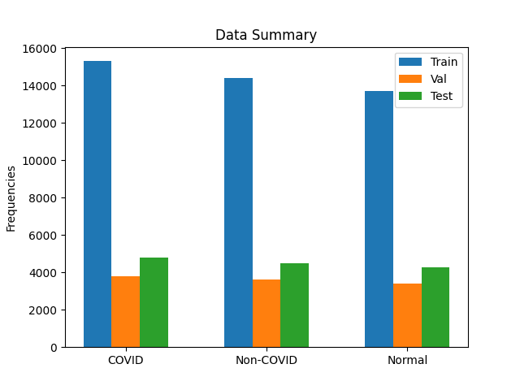
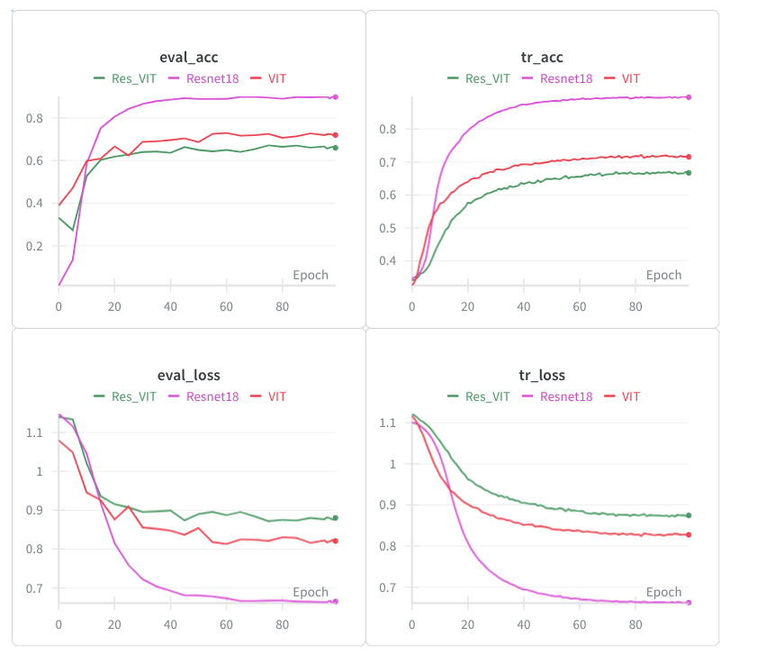
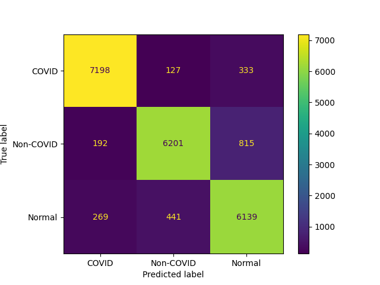
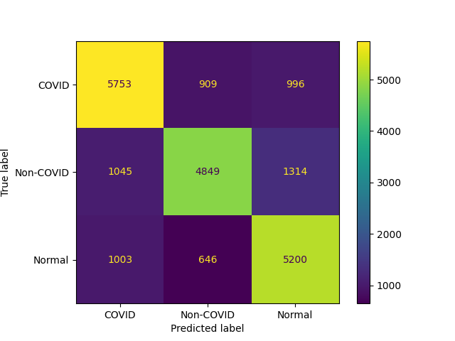
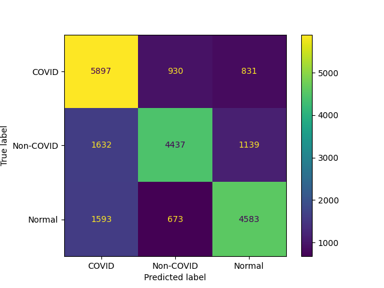

# COVID_transformer 

## Overview
**Purpose**: personal study project to play with Vision Transformer (ViT) architecture on medical imaging data.
Due to GPU limitations, the model is kept tiny (i.e. few layers, small embedding dimension, few heads, etc.) to allow training from scratch on a single GPU.

This project implements a tiny Vision Transformer (ViT) for COVID-19 detection from chest X-rays,
and benchmarks performance against:

- **ResNet-18** (standard CNN)  
- **ResNet-18 + ViT head** (i.e. ResNet backbone, pretrained on ImageNet1K and frozen for this task; and the ViT head, not pre-trained)  
- **ViT**

Note that the ViT model is implemented from scratch (for learning purposes), and never pre-trained on any image dataset.

The goal is to explore the effectiveness of transformer-based models on medical imaging, particularly in distinguishing COVID-19 cases in CXR data.
Our results (below) show that ViT-based models are **ineffective when they are not pre-trained**,
highlighting the importance of large-scale pretraining. Access to a substantially large training dataset is essential for developing a ViT model that generalizes well and achieves high accuracy.
In other words, transformers do not generalize reliably when trained on limited data.

### Dataset 
- The repository uses the **COVID-QU-Ex** dataset, which contains 33,920 chest X-ray images. This dataset can be found [here](https://www.kaggle.com/datasets/anasmohammedtahir/covidqu).
- This is a multiclass dataset with classes: COVID-19, Normal, and Pneumonia/Non-COVID.
- The dataset comprises three sets: Train, Val, Test. The following image summarizes this dataset. 

### Training
3 models including VIT, Resnet18, and VIT head with Res18 backbone (frozen) are trained and evaluated on Covid-QU-EX
dataset.
#### Training Notes
- AdamW optimizer with weight decay (AdamW provides better regularization than Adam.)
- Ensure dataset class balance to avoid biased predictions.
- Warm-up + cosine annealing learning rate strategy with small base learning rate

Train each model using its corresponding config file, available in `configs/` folder. For example:

``python run_train_eval.py --config configs/VIT_QU_EX.json``
To train other models, you could find other config files in ``config`` folder.

### Evaluation

On "Test" set, we compare the three models by acc, precision, recall, f_score. The confusion
matrices als show the models performance for classes.  

| Model Name   | Acc    | Precision   | Recall   | f_score   |
|--------------|--------|-------------|----------|-----------|
| Res18        | 89.9   | 89.9        | 89.8     | 89.7      |
| VIT          | 72.7   | 73.3        | 73.1     | 73        |
| Res18+VIT    | 68.6   | 69.5        | 68.7     | 68.8      |

| Res18                                 | VIT                                | Res18+VIT                              |
|---------------------------------------|------------------------------------|----------------------------------------|
|  |  |  |

