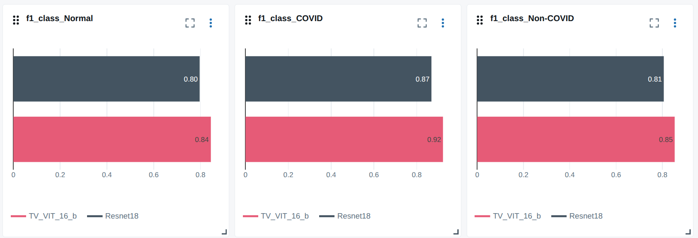
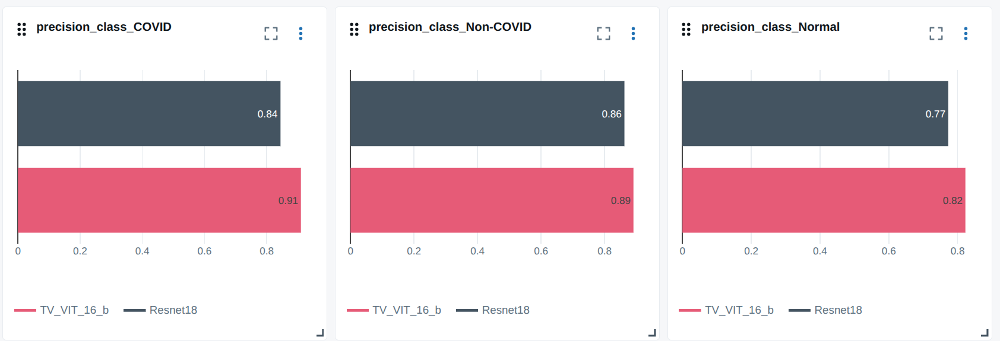
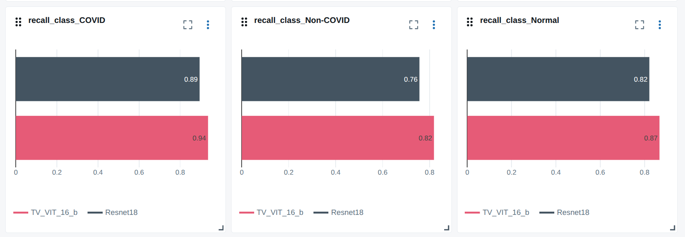
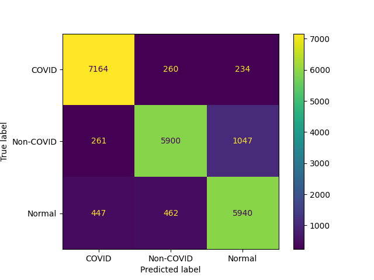

# COVID_transformer 

## Overview
**Purpose**: It is a self-study project to play with Vision Transformer (ViT) architecture for COVID-19 detection from chest X-rays. Then, benchmark its performance
against a standard CNN architecture (ResNet-18).

A base VIT model with 16x16 patches is used in this small study. The model and ResNet-18 are pretrained on ImageNet-1k and fine-tuned on COVID-QU-Ex dataset.

### Platform used
- Python 3.8, PyTorch 1.10.0, Torchvision 0.11.1  
- Trackio and Mlflow for experiment tracking
- GPU: NVIDIA RTX 4060 Laptop GPU

### Dataset 
- The repository uses the **COVID-QU-Ex** dataset, which contains 33,920 chest X-ray images. This dataset can be found [here](https://www.kaggle.com/datasets/anasmohammedtahir/covidqu).
- This is a multiclass dataset with classes: COVID-19, Normal, and Pneumonia/Non-COVID.
- The dataset comprises three sets: Train, Val, Test. The following image summarizes this dataset. 

#### Training Notes
The following strategies were used for training the models:
- AdamW optimizer with weight decay (AdamW provides better regularization than Adam.)
- Warm-up + cosine annealing learning rate strategy with small base learning rate
- Ensure dataset class balance to avoid biased predictions.

Train each model using its corresponding config file, available in `configs/` folder. For example:

``python run_train_eval.py --config configs/TV_VIT_b_16.json``
To train other models, you could find other config files in ``config`` folder.

### Evaluation

On "Test" set, we compare the three models by acc, precision, recall, f_score. The confusion
matrices also show the models performance for classes.  

The following results show that ViT-based models outperform ResNet-18 by a significant margin, on all metrics (accuracy, precision, recall, f1-score). However, ViT has many more parameters than ResNet-18, making training it challenging for restricted-resource devices like laptop GPU.
| Model Name | Acc   | Precision | Recall | f1_score | parameters |
|------------|-------|-----------|--------|----------| -----------|
| Res18      | 82.56 | 82.66     | 82.41  | 82.37    |11.24M      |
| VIT_b_16   | 87.51 | 87.45     | 87.37  | 87.33    |85.8M       |

  
| Res18                                 | VIT_b_16                               |
|---------------------------------------|----------------------------------------|
|  |  |

